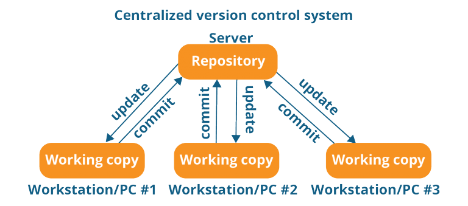
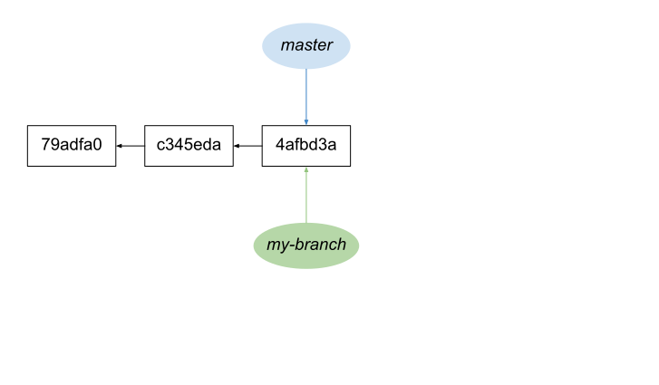
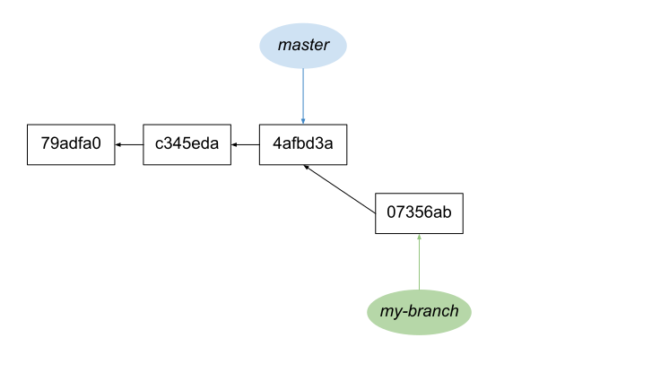
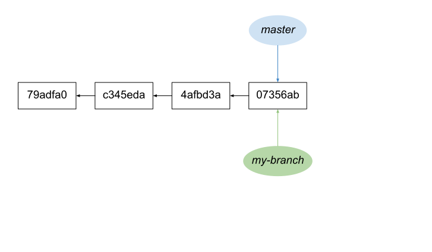
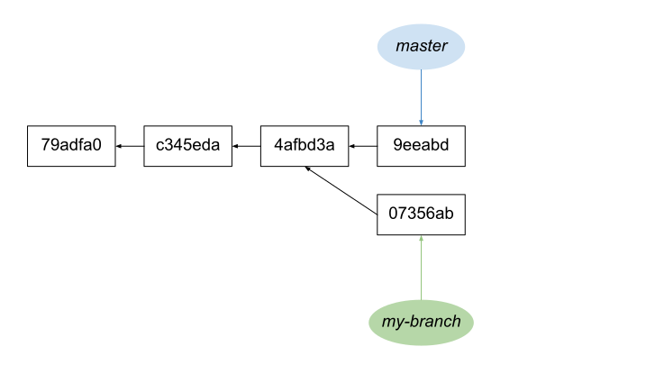
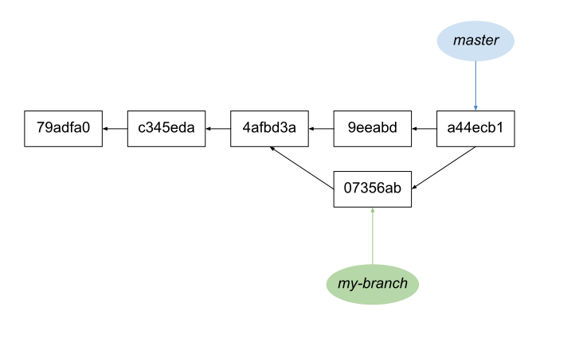
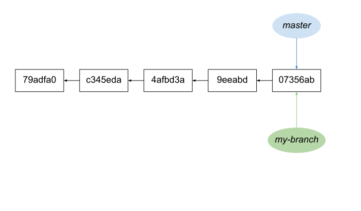
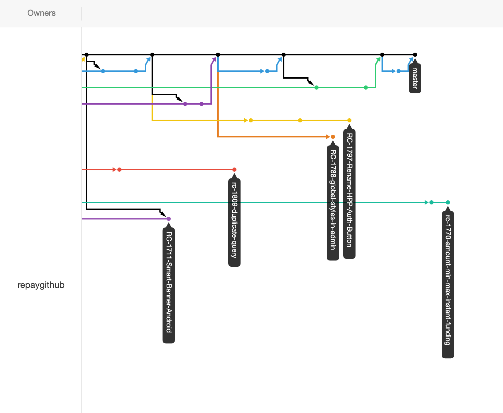
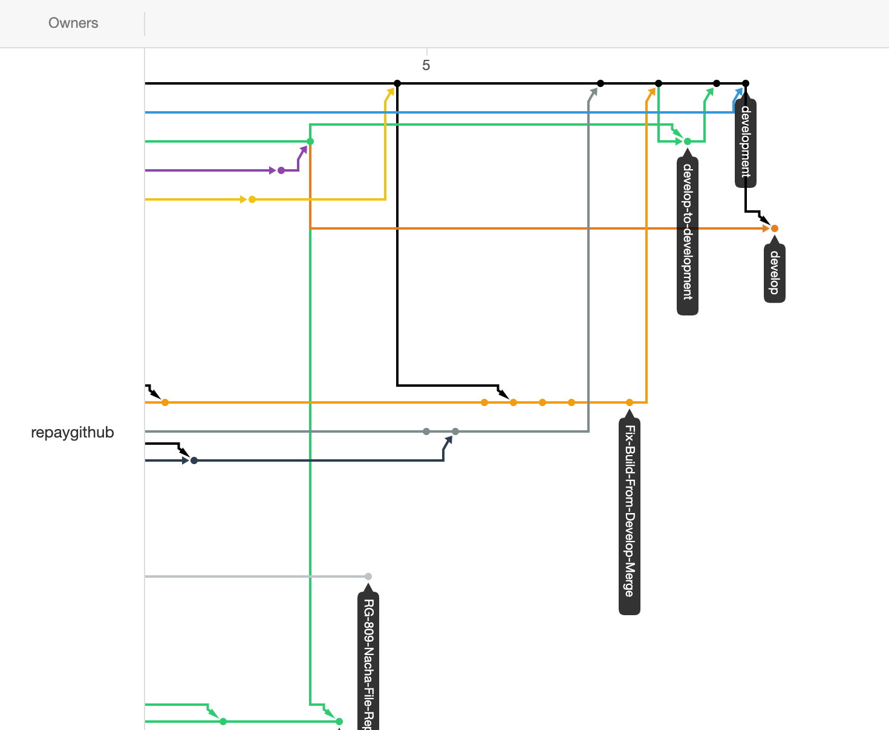

import { Appear, Notes, Image } from 'mdx-deck'
import { Invert } from 'mdx-deck/layouts'
import RainbowText from './components/RainbowText.jsx'

<RainbowText text="Hitchhiker's Guide to Git" />

<div style={{ position: 'fixed', bottom: 0, left: '50%', transform: 'translate(-50%, 0)' }}>
  Use the left <kbd>&#8678;</kbd> and right <kbd>&#8680;</kbd> arrows to navigate.
</div>

---

<Invert>

# Before Version Control

the dark ages...

</Invert>

---

#### just kidding, nobody cares about the "before" times

---

## Purpose of Version Control

**Productivity**: Enable multiple developers to work<br/>
on the same codebase independently.

**Security**: Maintain a history of file changes in order<br/>
to facilitate fast reversion to a known, working commit.

---

## Models of Version Control

<ul>
  <Appear>
    <li key="1">Atomic operations</li>
    <li key="2">File locking</li>
    <li key="3">Version merging</li>
    <li key="4">Baselines, labels and tags</li>
  </Appear>
</ul>

<Notes>
  <ul style={{fontSize: "1rem"}}>
    <li>Atomic operations - operations can be reversed</li>
    <li>File locking prevents multiple commits to same file</li>
    <li>Version merging is providing a strategy to combine changes from different sources</li>
    <li>tags are a snapshot of a repository at a specific point in time in a specific location</li>
  </ul>
</Notes>

---

# Centralized vs Distributed

---



### A centralized system only has a single repository.

CVS, Subversion, VisualSourceSafe, etc.

<Notes>

Subversion being the most popular, used by: Apache, GCC, Ruby, WebKit

</Notes>

---


### In a distributed system, everyone has a repository.

Git, Mercurial, Bazaar (bzr), etc.

<Notes>

git and mercurial are both popular:

- git: literally Github and all code on it
- mercurial: Mozilla,  OpenJDK (Java), Python

</Notes>

---

## Let's talk about git

<Appear>

_it's distributed_

_capable of atomic operations_

_has version merging_

_and has tags_

</Appear>

---

Some slide thing

---

<figure>
  
  <figcaption style={{ fontSize: '1.5rem', margin: '1.5rem' }}>
    A diagram representing two areas. The first being a remote 
    server which contains the remote repository. The second area
    being the local development environment containing the working
    directory of files, a staging area, and the local repository.
  </figcaption>
</figure>

---

<figure>
  
  <figcaption style={{ fontSize: '1.5rem', margin: '1.5rem' }}>
    Running git clone will generate the working directory
    and the local repository from the remote.
  </figcaption>
</figure>

---

<figure>
  
  <figcaption style={{ fontSize: '1.5rem', margin: '1.5rem', textAlign: 'left' }}> 
    <b>Tracked</b>: files that Git knows about.<br/>
    <b>Untracked</b>: files that have still not been added, so Git doesn’t know about.
  </figcaption>
</figure>

---

<figure>
  
  <figcaption style={{ fontSize: '1.5rem', margin: '1.5rem' }}> 
    Changes are added from the working directory to staging, then
    committed to the local repo, and finally pushed
    to a branch on the remote repository.
  </figcaption>
</figure>

<Notes>

Changes can be moved throughout these phases in the development environment
with no fear of affecting other contributors. However, pushing mono is now
interacting with other people and so we must be conscientious.

</Notes>

---

<figure>
  
  <figcaption style={{ fontSize: '1.5rem', margin: '1.5rem' }}> 
    git diff can be used to review the tracked and commited changes.
  </figcaption>
</figure>

---

If you're working on a project solo, git is easy!

```sh
  # add all files
  git add .
  
  # commits all pending changes
  git commit -m "les updates"
  
  # push all commits to same branch on remote repo
  git push -u origin
```

<Appear>

</Appear>

---

> "But James, Repay has lots of developers; what will we ever do?"
>
>  \- Clint, probably


---

### Never fear, branching is here!


---

## What is branching?

<Appear>

Let's review the basics of branch theory.

</Appear>

---



```sh
git checkout -b my-branch
```

<Notes>

Create a branch named my-branch off of master. The HEAD of 
each branch still point to the same commit.

</Notes>

---

{{make some changes to the working directory}}

---



```sh
git add -p
git commit --message "update some things"
```

---

But now we need to get our changes back into the master<br/>
branch from which the code is deployed.

---

## Merging

---


```sh
git add -p
git commit --message "update some things"
```

---



```sh
git checkout master
git merge --ff my-branch
```

---

### This is called fast forwarding

Hence the --ff command

<Notes>

However, the fast-forward option is the default, so it's unnecessary when there is no divergence.

</Notes>

---

What about when there are commits in both<br/> master and my-branch?

---

## actual merging

`git merge <branch>`

---



```sh
git add -p
git commit --message "update some things"
```


<Notes>

Divergence happens when there are different commits in each branch.

</Notes>

---



```sh
git checkout master
git merge my-branch
```

<Notes>

Will automatically merge the versions and creates a merge commit
representing this operation.

</Notes>

---

<code style={{ textAlign: 'center' }}>
Merge branch 'my-branch' into master
</code>

<Appear>

But merge commits can feel gross.

Sometimes you're a perfectionist and want a clean commit history.

</Appear>

---

### fast-forward or GTFO.

`git merge --ff-only my-branch`

<Appear>

But this is going to error because your branch is still divergent.

</Appear>

---


```sh
git add -p
git commit --message "update some things"
```


<Notes>

Your branch is divergent so you can't fast-forward.

</Notes>

---



```sh
git checkout master
git merge --rebase my-branch
```

---


Rebasing re-writes each commit, one by one, on top<br/>
of what is already in the branch

---


<Notes>

Just to show the process again.

</Notes>

---


---

## Real examples in our repositories

---



---



---

Most remote repositories default with a _master_ branch.

We then create _pull requests_ to _merge_ into the main branch
to combine our updates with the <i>one to rule them all</i>.

---

We've cloned the repository

but someone has pushed changes to the remote.

<Appear>
<p>How do I get those changes?</p>
</Appear>

---

<figure>
  
  <figcaption style={{ fontSize: '1.5rem', margin: '1.5rem' }}>
    <code>git fetch origin</code>
    Git fetch applies changes from the remote
    repository to your local repository.
  </figcaption>
</figure>

---

Git fetch will not update the working directory.

For that we need:

`git pull`

---

<figure>
  
  <figcaption style={{ fontSize: '1.5rem', margin: '1.5rem' }}>
    Git pull updates both the local repository <b>and</b> the working
    directory.
  </figcaption>
</figure>

---

`git pull`

Will generate a merge commit if the local branch is divergent

<Appear>


</Appear>

---

## Try fast-forward

`git pull --ff-only origin master`

<Notes>

I use this almost exclusively when trying to
update master to ensure I don't have accidental
commits to master in my local repository.

</Notes>

---

But what if we want to update from master to our branch

<Appear>

And we're divergent, **but** we don't want a merge commit?

</Appear>

---

## Back to rebase-ics!

`git pull --rebase origin master`

<Notes>

I use this and rebase almost exclusively because it's the last time I get to check my work
before merging with the hive mind.

</Notes>

---

<figure>
  
  <figcaption style={{ fontSize: '1.5rem', margin: '1.5rem' }}>
    Git fetch applies changes from the remote
    repository to your local repository.
  </figcaption>
</figure>

---

`git pull -r origin master`

Will attempt to re-write each local commit on top of the remote.

<Appear>

For each commit, you will need to resolve conflicts.

</Appear>

---

<Appear>
<code>git pull -r origin master</code>
<p>{'{{ resolve conflicts }}'}</p>
<code>git add .</code>
<code>git rebase --continue</code>
<p>...repeat until all commits are re-written</p>
</Appear>

---

{{ have local commits }}

<Appear>
<code>git pull -r origin master</code>
<p>{'{{ EVERY FILE HAS A CONFLICT }}'}</p>

</Appear>

---

<RainbowText text="DON'T PANIC" />

<code>git pull -r origin master</code>
<p>{'{{ EVERY FILE HAS A CONFLICT }}'}</p>

<Appear>
<code>git rebase --abort</code>
<code>git pull origin master</code>

</Appear>

---

# Pull Requests

---

Github<sup><small>TM</small></sup> also allows us to _protect_ branches with<br/>
different rules and requirements to help us maintain<br/>
the integrity of the main branch.

This is frequently represented as _status_ checks, but also approvals

<Notes>

This gets at a core purpose of version control for a lot of companies and a major reason
developers pay for Github, Bitbucket, Gitlab, ...

</Notes>

---

How to review a pull request?

<Appear>
<code>git checkout pull-request-branch</code>
<p>{'{{ run application and manually test changes }}'}</p>
</Appear>

---

Even if you don't feel comfortable reviewing a PR;

pulling down the code and manually testing the<br/>
application will quickly improve your understanding.

<Notes>

At some point you will get an understanding of which PRs
you want to pull down and test or which ones you can just
review on the web.

</Notes>

---

## Should you use a GUI

<Appear>
<p>Why not?</p>
<p>Source Tree treated me well</p>
</Appear>

<Notes>

I learned by using a GUI, first Source Tree; then the built-in with Intellij. I only
started using the command line 2 years into my career. There was also about 3 months
of committing straight to master with one other developer who also had almost no knowledge
of git.

</Notes>

---

# Advanced Usage

---

## Using the Stash

saves changes to _tracked_ files

---

Have some changes and you're not ready to commit?

<Appear>
<code>git stash</code>
<p>{'{{ changes are removed from working }}'}</p>
<code>git stash pop</code>
<p>{'{{ changes are re-applied to working }}'}</p>
</Appear>

---

## Cherry-picking

Takes arbitrary commits and applies them to the top<br/>
of the current branch.

`git cherry-pick <commit hash>`

---

## Undoing staged commits

`git checkout <filepath>`

`git checkout .`

---

## Undoing commits

`git reset HEAD <commit hash>`

`git reset HEAD~1`

---

## Fork a repository

Most Git clients let you "fork" a repository,<br/>
which creates a copy of the remote repository.

<Appear>
<p>This lets you change and use the code without<br/>
affecting the main codebase.</p>
<p>You can then submit your changes in a PR across forks!</p>
</Appear>

<Notes>

Most open source code operates this way.

</Notes>

---

Did you know you can have any number of named remote repositories?

<Appear>
<p>
  Convention is to add a remote called <i>upstream</i><br/>
  and use it to keep your fork at origin synchronized
</p>
</Appear>

---

## Further Reading

- [_Git stash_](https://www.atlassian.com/git/tutorials/saving-changes/git-stash)
- [_Git cherry-pick_](https://www.atlassian.com/git/tutorials/cherry-pick)
- [_Fork a repo_](https://help.github.com/en/articles/fork-a-repo)

---

## Sources

- [_How to Teach Git_ by Rachel M. Carmena](https://rachelcarmena.github.io/2018/12/12/how-to-teach-git.html)
- [_Learn git concepts, not commands_ by Nico Riedmann](https://dev.to/unseenwizzard/learn-git-concepts-not-commands-4gjc)

---

<RainbowText text="La Fin" />

Questions?
